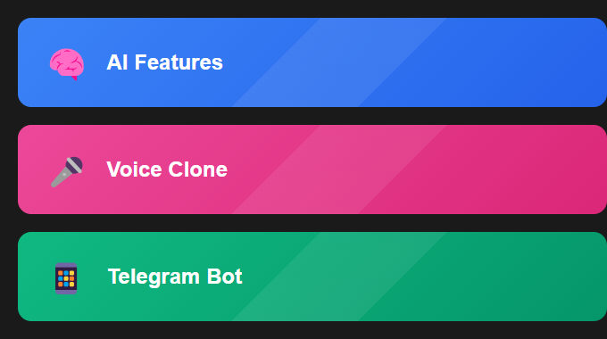

# 🤖 AI Persona Bot

<div align="center">


[](https://www.python.org/)
[](https://openai.com/)
[](https://core.telegram.org/bots/api)
[](https://www.mongodb.com/)
[](https://fastapi.tiangolo.com/)

[English](#english) | [Русский](#русский)

</div>

---

<a name="english"></a>
# 🇺🇸 English

<div align="center">

</div>

## 📋 About
AI Persona Bot is an advanced Telegram bot that creates your digital twin by analyzing your communication style from messages and Yandex Zen posts. Features voice message support through OpenAI TTS.

## ✨ Key Features
- 🧠 Smart message style analysis
- 🎤 Voice message cloning
- 📱 Telegram integration
- 📝 Yandex Zen content analysis
- 🔄 Real-time learning

<div align="center">

</div>

## 🛠️ Tech Stack
- 🐍 Python 3.9+
- 🤖 OpenAI GPT & TTS
- 📱 Telegram Bot API
- 🗄️ MongoDB
- ⚡ FastAPI

## 🚀 Quick Start
```bash
# Clone repository
git clone https://github.com/Ivantech123/cloneself.git
cd cloneself

# Install dependencies
pip install -r requirements.txt

# Set up environment variables
cp .env.example .env
# Edit .env with your API keys

# Run the bot
python main.py
```

---

<a name="русский"></a>
# 🇷🇺 Русский

## 📋 О проекте
AI Persona Bot - продвинутый Telegram бот, создающий вашего цифрового двойника путем анализа стиля общения из сообщений и постов Яндекс Дзен. Поддерживает голосовые сообщения через OpenAI TTS.

<div align="center">

</div>

## ✨ Возможности
- 🧠 Умный анализ стиля сообщений
- 🎤 Клонирование голоса
- 📱 Интеграция с Telegram
- 📝 Анализ контента Яндекс Дзен
- 🔄 Обучение в реальном времени

## 🛠️ Технологии
- 🐍 Python 3.9+
- 🤖 OpenAI GPT и TTS
- 📱 Telegram Bot API
- 🗄️ MongoDB
- ⚡ FastAPI

## 🚀 Быстрый старт
```bash
# Клонировать репозиторий
git clone https://github.com/Ivantech123/cloneself.git
cd cloneself

# Установить зависимости
pip install -r requirements.txt

# Настроить переменные окружения
cp .env.example .env
# Отредактируйте .env, добавив свои API ключи

# Запустить бота
python main.py
```

## 📦 Структура проекта
```
src/
├── bot/          # Telegram бот
├── ai/           # AI модели
├── voice/        # Голосовые функции
├── storage/      # Работа с данными
└── utils/        # Утилиты
```

## 📫 Контакты
Email: abloko362@gmail.com

## Быстрый старт

### Автоматическая установка (рекомендуется)

1. Скачайте этот репозиторий
   ```
   git clone <your-repo-url>
   cd tg_channel_parser
   ```

2. Запустите `install_all.bat`
   - Автоматически установит Python, если его нет
   - Создаст виртуальное окружение
   - Установит все зависимости
   - Создаст необходимые файлы конфигурации

3. Настройте файл `.env` (как получить все ключи - см. [подробное руководство](SETUP_GUIDE.md))
   ```
   OPENAI_API_KEY=your_openai_api_key_here    # https://platform.openai.com/api-keys
   TELEGRAM_BOT_TOKEN=your_bot_token_here     # @BotFather в Telegram
   API_ID=your_telegram_api_id_here           # my.telegram.org
   API_HASH=your_telegram_api_hash_here       # my.telegram.org
   PHONE=your_phone_number_here               # Ваш номер телефона
   ```

4. Запустите `start.bat` для запуска бота

👉 **[Подробное руководство по установке и настройке](SETUP_GUIDE.md)**

### Ручная установка

Если автоматическая установка не сработала:

1. Установите [Python 3.8 или выше](https://www.python.org/downloads/)
   - При установке обязательно отметьте "Add Python to PATH"

2. Запустите `setup.bat`

3. Следуйте инструкциям выше начиная с пункта 3

## Возможности

- Анализ стиля сообщений из Telegram и постов из Дзен
- Умное определение тона сообщений (юмор/серьезность)
- Контекстные ответы с учетом истории диалога
- Поддержка эмодзи и форматирования
- 🎤 Голосовые сообщения с помощью OpenAI TTS
  - Команда /voice для включения/выключения
  - Реалистичный голос
  - Поддержка русского языка

## Структура проекта

- `ai_persona_bot.py` - основной файл бота
- `install_all.bat` - скрипт полной установки (включая Python)
- `setup.bat` - скрипт установки зависимостей
- `start.bat` - скрипт запуска
- `.env` - файл с конфигурацией
- `requirements.txt` - зависимости проекта
- `SETUP_GUIDE.md` - подробное руководство по установке

## Требования

- Windows 7/8/10/11
- Интернет-подключение для установки
- OpenAI API ключ ([получить здесь](https://platform.openai.com/api-keys))
- Telegram Bot Token ([@BotFather](https://t.me/BotFather))
- Telegram API credentials ([my.telegram.org](https://my.telegram.org/auth))

## Поддержка

Если у вас возникли проблемы:
1. Прочитайте [подробное руководство](SETUP_GUIDE.md)
2. Проверьте раздел "Возможные проблемы и решения" в руководстве
3. Создайте issue в репозитории с описанием проблемы
